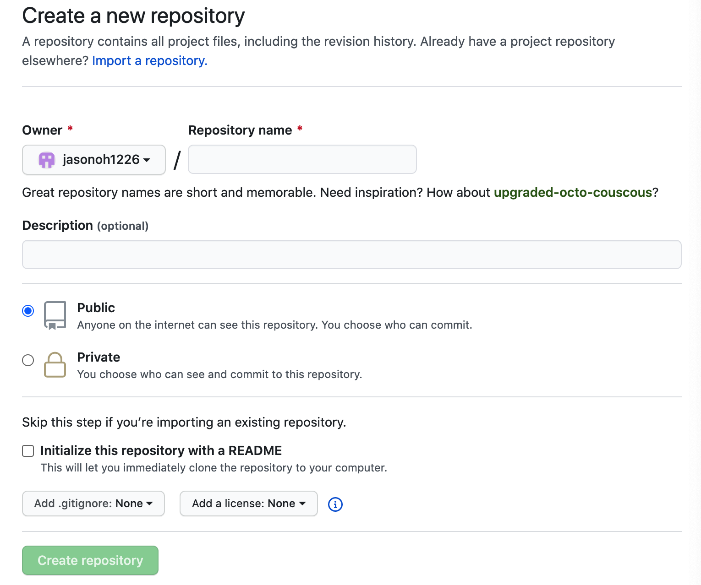

##### Learn how to configure Gatsby to deploy a blog site on Github pages

&nbsp;

Gatsby is a **free** and **open source framework** based on React that helps developers build blazing fast web applications, whche are easy to deploy and serve. Gatsby has risen in popularity over the last years because of its ability to integrate with various data sources through GraphQ and deployment to a variety of hosts.

In this post, we will look at how you can get started with Gatsby, build a static site and deploy it through GitHub pages for free.

---
&nbsp;

### Create a Gatsby project ###

&nbsp;

1. Install Node.js
```shell
brew install node
```
Or download from [https://nodejs.org](https://nodejs.org/en/)


2. Install Git

&nbsp;&nbsp;&nbsp;&nbsp;&nbsp;&nbsp;&nbsp;&nbsp;&nbsp;
Download from [https://git-scm.com](https://git-scm.com/downloads)

3. Install Gatsby CLI
```shell
npm i -g gatsby-cli
```

4. Create a Gatsby Site
```shell
gatsby new my-gatsby-blog
```
```shell
cd my-gatsby-blog
gatsby develop
```

---
&nbsp;

### Set up GitHub Pages ###

GitHub pages lets you turn github repositories into elegant websites to showcase your portfolio, your projects, documentations, or anything else you want to share with the world. There are no databases to set up and no servers to configure. If you're already using github, it's the most direct path to create websites for you and your projects.

&nbsp;

##### **Create a new repository**

GitHub Pages allows each user **one “user site”** (username.github.io) and **unlimited “project sites”** (username.github.io/projectname). Each organization also has one “organization site” and unlimited “project sites”. **User and organization** sites must be deployed from the **master branch** on GitHub Pages, and **project** sites can be deployed from either the **master** branch or a branch called **“gh-pages.”**



&nbsp;
##### **Create a master branch**

---
&nbsp;


### Deploy a Gatsby Site into your repository
&nbsp;

```shell
Git init
```

```shell
Git add README.md 
Git commit -m “first commit”
```

```shell
git remote add origin https://github.com/jasonoh1226/jasonoh1226.github.io.git
```

This command creates dev branch
```shell
git checkout -b dev master
```

```shell
git add . && git commit -m “message”
```


```shell
git push -u orgin dev
```


### Add the Custom Domain to your GitHub page

&nbsp;


https://medium.com/@jacky_ttt/day063-how-to-deploy-to-github-pages-7bf6a26452b2